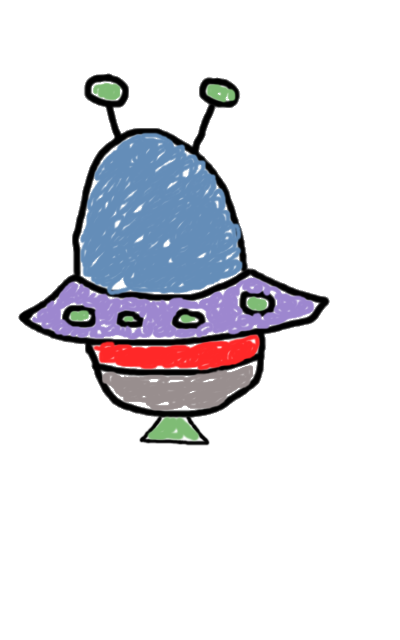

# Lunar lander con html, css y javascript

Juego terminado: https://rawgit.com/ach74/LunaLander-Ach74aaaaaa/master/index.html

**Autor:** Achraf El Ouakili

**Asignatura:** Lenguaje de marcas

## PROYECTO:

El objetivo final de este proyecto es desarrollar un juego, en que una nave tiene que aterrizar en la luna, este mismo sera creado estéticamente con HTML y CSS. El desplazamiento de la nave y las funciones de los paneles de control estarán definidos en el JavaScript.
El proyecto que he decidido desarrollar ha sido el que diseñe al principio de este proyecto, pero añadiendo algunas modificaciones.

Este es el resultado final para la versión de ordenador:

Y este es el resultado final para la versión para móviles:

## Explicación:

### Botones de la versión para ordenador:

Como se puede observar en la versión para ordenadores tenemos una serie de opciones para interactuar con el juego:

* El primer botón situado más a la izquierda, es el de sonido. Una vez pulsado sonara una melodía que nos acompañara mientras jugamos. Por defecto el juego viene silenciado. Cuando pulsemos este boton tambien cambiara. Y pasaremos a tener otro que nos permitira silenciar el juego.
Los botones que irán intercambiando entre si son los siguientes:

* El siguiente es el de reinicio, con el podremos volver a empezar cuando queramos.

* A continuación viene el botón encargado de pausar el juego o ponerlo en marcha. Este botón ira alternando entre los dos estado según lo pulsemos. Por defecto viene en pausa.

* El botón que veremos a continuación es el botón de "Ayuda" que nos abrirá una pestaña donde nos explicara el juego. Panel que abrirá es el siguiente:

Como podemos observar hay un botón el de "About" si le damos nos llevara a otra pagina donde nos hablaran un poco más del juego.

* Por ultimo tenemos el botón de "Ajustes", el cual una vez desplegado nos mostrara las siguientes funciones:

Como se muestra podremos cambiar la dificultad y la nave solo con hacer click. Al cambiar la nave, lo que se hace es ocultar la imagen de la nave que sé está mostrando, para poner en visible la que está oculta. Y así sucesivamente. Las naves con las cuales podremos jugar son las siguientes:

Si lo que queremos es cambiar la dificultad del juego, solo con elegir una de las opciones que se nos muestra bastara. Dependiendo el nivel de dificultad que elijamos el valor que influye sobre la gravedad aumentara o disminuirá.

### Botones de la versión para móvil:

Para la versión móvil tenemos menos botones en pantalla, un total de 2:

* El botón rojo, es el encargado de recoger todos los demás botones que teníamos en la versión para ordenador. Una vez le demos se nos mostraran la mismas opciones que tenemos para ordenador pero recogidas en un recuadro que se mantiene oculto cuando jugamos. Ademas de queuna ves le demos el juego de pausara.

El panel que se nos va a desplegás es el siguiente:

Como podemos observar tenemos las mismas opciones que teníamos en la versión de escritorio, con lo cual hacen las mismas funciones.

* El botón verde (Pause) hace lo mismo que en la versión de escritorio. Controlar si el juego para detenerlo o no.

### Indicadores:

En las dos versiones tenemos los mismos indicadores solo que en la versión para móviles, la anchura se hace un poco más pequeña. Los indicadores son los siguientes :

* El indicador de velocidad nos marcara a que velocidad estamos cayendo, o por su contrario ascendiendo.

* El indicador de altura nos marcara cuenta distancia estamos cayendo.

* El siguiente es el indicador de fuel, que mediante una barra vertical nos mostrara cuanta gasolina nos queda en el tanque de gasolina.

### Otros elementos:

* Cuando interactuemos con algún elemento que nos vaya a mostrar información o más opciones, como por ejemplo la opción de "Ayuda", tenemos un botón situado en la parte superior izquierda, que nos permite volver atrás, o más bien hacer que desaparezca el elemento que hemos abierto.

El botón es el siguiente:

* Otro botón muy importante es el botón para propulsar la nave, en este caso tiene aspecto de palanca, y solo propulsa la nave cuando estos pulsando en él, este botón se mantiene automáticamente apagado cuando no es usado o cuando el juego ha finalizado. Ademas de que cambia de aspecto según lo pulsemos o no.

Aquí le muestro sus dos estados:
Botón sin ser pulsado:

Botón pulsado:

## Inicio del juego

Una vez iniciemos el juego la nave ira descendiendo dependiendo de la dificultad elegida. Y para controlar dicho descenso tenemos el botón de propulsión que cada ver que lo pulsemos la imagen de la nave cambiara a un "GIF", que nos dará la impresión de que esta desprendiendo fuego. Dichos "GIF" son los siguientes:

